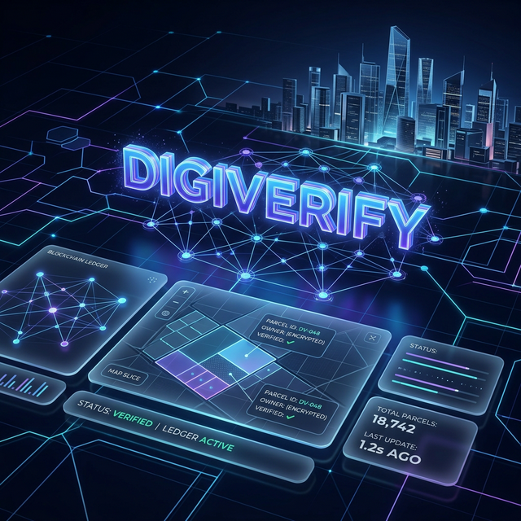
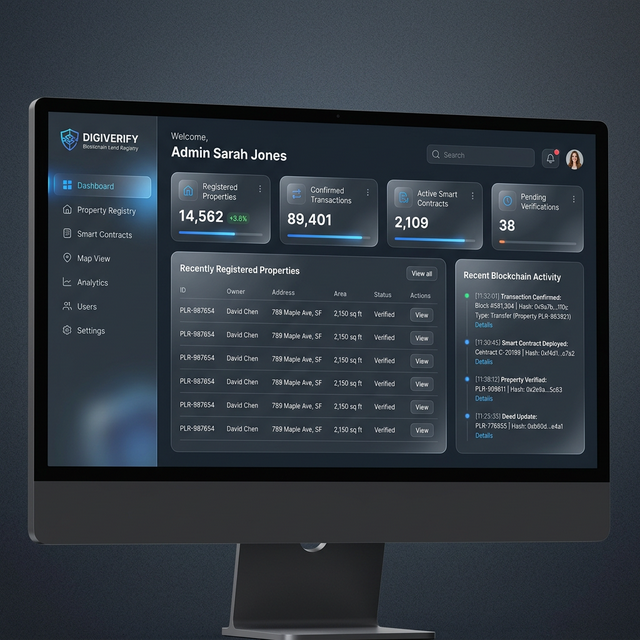
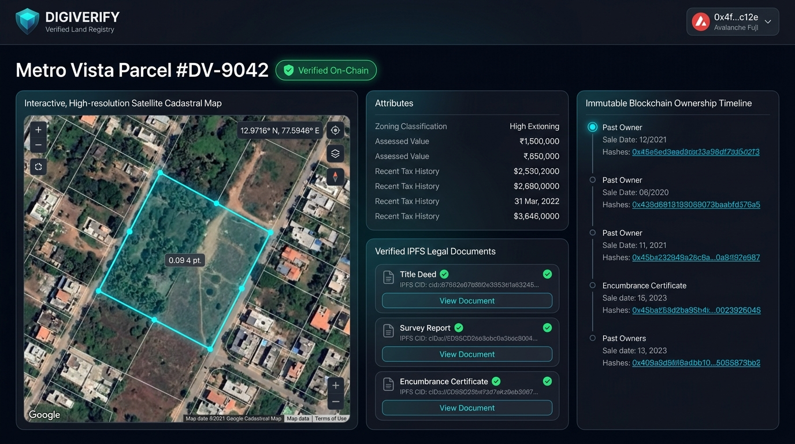
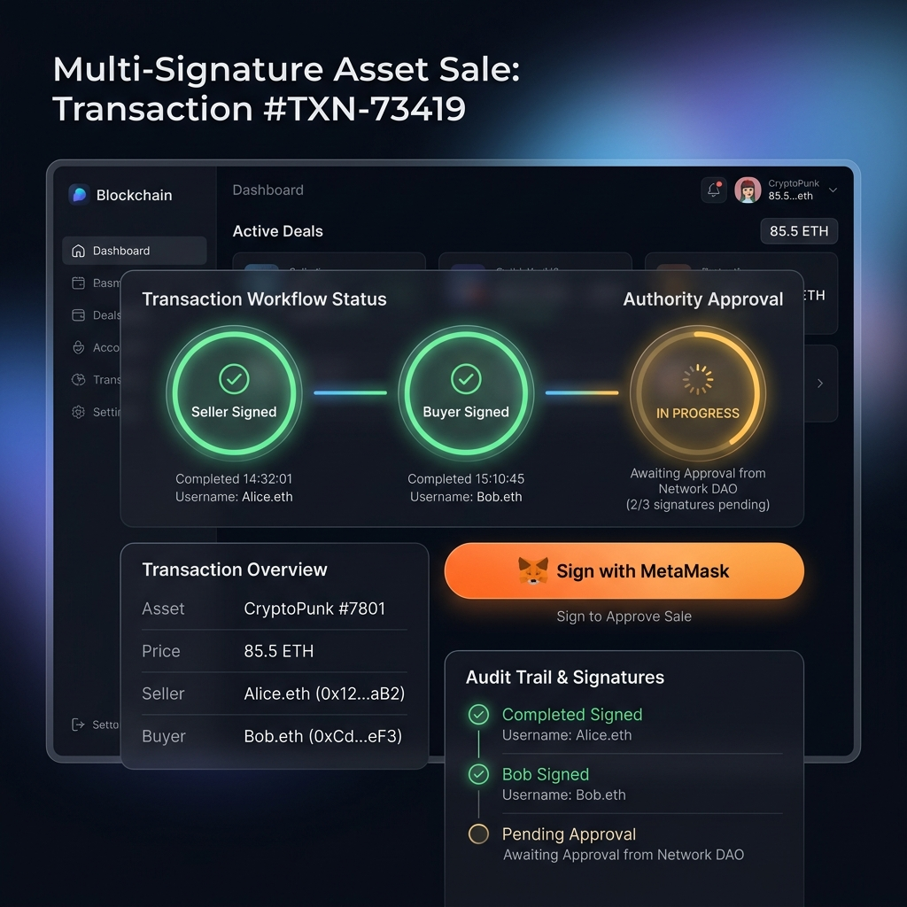
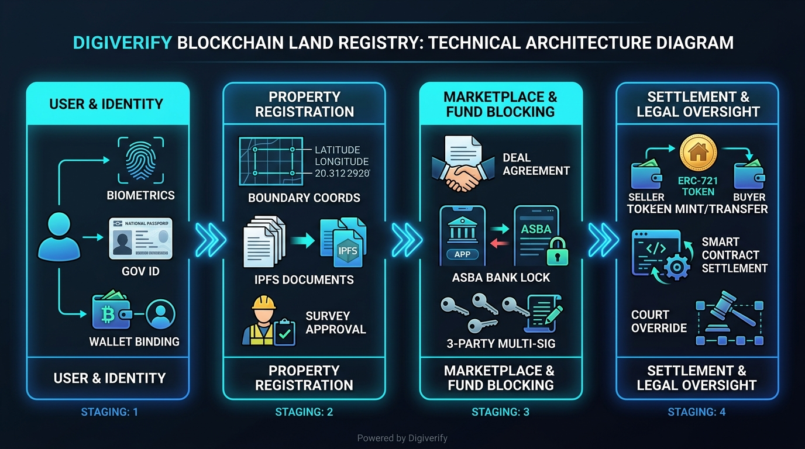

# Digiverify

<div align="center">



### **Government-Grade Trustless Land Registry & Verification Platform**
*Next-generation property tokenization, multi-signature transaction settlements, and tamper-proof judicial oversight on Avalanche.*

[-E84142?style=for-the-badge&logo=avalanche&logoColor=white)](https://testnet.snowtrace.io/)
[](https://soliditylang.org/)
[](https://nodejs.org/)
[](https://react.dev/)
[](https://www.postgresql.org/)
[](https://ipfs.tech/)
[](LICENSE)

</div>

---

## Table of Contents

- [Overview](#overview)
- [Key Features](#key-features)
- [System Previews](#system-previews)
- [System Architecture & Lifecycle](#system-architecture--lifecycle)
- [Smart Contract Ecosystem](#smart-contract-ecosystem)
- [Technical Stack](#technical-stack)
- [Project Structure](#project-structure)
- [Setup & Installation](#setup--installation)
  - [Prerequisites](#prerequisites)
  - [1. Database Setup](#1-database-setup)
  - [2. Smart Contract Deployment](#2-smart-contract-deployment)
  - [3. Backend Configuration & Execution](#3-backend-configuration--execution)
  - [4. Frontend Configuration & Execution](#4-frontend-configuration--execution)
- [API Overview](#api-overview)
- [Security & Compliance](#security--compliance)
- [License](#license)

---

## Overview

Traditional land registry systems suffer from severe vulnerabilities: document forgery, fraudulent multiple sales of the same parcel, non-transparent bureaucratic processes, and slow judicial dispute resolution.

**Digiverify** solves these systemic problems by combining:
1. **ERC-721 Property Tokenization** on the **Avalanche Fuji C-Chain**, creating immutable, on-chain digital land titles.
2. **ASBA-Style Bank Fund Blocking**, preventing escrow defaults and payment fraud during real estate transactions.
3. **Cryptographic Multi-Signature Settlement**, requiring non-repudiable wallet signatures from the Seller, Buyer, and Government Land Authority.
4. **Court Override & Dispute Protection**, allowing judicial authorities to freeze contested titles or reverse fraudulent transactions transparently on-chain.
5. **Decentralized IPFS Storage**, securing survey reports, tax certificates, and title deeds backed by SHA-256 integrity hashes.

---

## Key Features

- **ERC-721 Digital Title Tokenization**: Land ownership is minted as a non-fungible token containing unique government parcel identifiers, boundary coordinates, and document hashes.
- **3-Party Multi-Signature Settlement**: Enforces on-chain consensus where the Seller, Buyer, and Land Authority must each sign with their cryptographic wallets before ownership is transferred.
- **ASBA-Style Fund Blocking Protocol**: Simulates an Applications Supported by Blocked Amount (ASBA) banking mechanism that locks buyer funds in their account and guarantees payout only upon on-chain deed finalization.
- **Judicial Court Override**: Dedicated smart contract interface (`CourtOverride.sol`) empowering judicial authorities to freeze disputed properties, reverse illegal transfers, or cancel tainted transactions.
- **Tamper-Proof Document Storage**: Deeds, survey maps, and revenue records are pinned to IPFS via Pinata, with their cryptographic hashes permanently anchored to the smart contract.
- **Biometrics & KYC Wallet Binding**: User profiles are linked to verified government IDs, biometric captures, and dedicated cryptographic wallet addresses with recovery mechanisms.

---

## System Previews

### 1. Centralized Authority & Admin Dashboard
Provides real-time oversight of pending KYC verifications, property registrations, survey reports, active sale pipelines, and system audit logs.



---

### 2. Property Verification & Immutable Record Explorer
Displays high-precision boundary coordinates, IPFS-backed legal documents (Title Deeds, Survey Reports, Encumbrance Certificates), and verifiable ownership history.



---

### 3. Multi-Signature Transaction Signing
Enforces on-chain approval from all parties with direct Web3 wallet integration (MetaMask) to execute secure land transfers.



---

## System Architecture & Lifecycle



### Complete End-to-End Workflow

1. **User Onboarding & KYC**:
   - Users register with Aadhaar/Gov ID verification and biometric authentication.
   - A Web3 wallet address is cryptographically bound to the user profile.
2. **Property Submission & Verification**:
   - Landowner submits parcel details, boundary coordinates, and legal documents.
   - Documents are pinned to IPFS, and a document integrity hash is generated.
   - A government surveyor reviews and approves the application.
3. **NFT Minting & Registration**:
   - Upon authority approval, `LandRegistry.sol` instructs `LandNFT.sol` to mint an ERC-721 token representing the verified parcel.
4. **Sale Initiation & Fund Blocking**:
   - Seller creates a formal sale agreement referencing the Buyer's wallet.
   - Buyer initiates an ASBA-style bank fund block, locking transaction funds securely.
5. **Multi-Signature Execution**:
   - **Seller** signs the transfer transaction using MetaMask.
   - **Buyer** inspects terms and signs the purchase transaction.
   - **Regulatory Authority** applies the final cryptographic "seal".
6. **Chain Settlement**:
   - `SaleContract.sol` completes the transfer, burns/transfers the NFT, and triggers the payout.
7. **Judicial Safeguards**:
   - If a dispute arises at any stage, `CourtOverride.sol` allows designated judicial keys to freeze or revert the title.

---

## Smart Contract Ecosystem

The smart contracts are written in Solidity `0.8.28`, compiled with Hardhat, and deployed on the **Avalanche Fuji C-Chain**.

| Contract | Purpose | Fuji Testnet Address |
| :--- | :--- | :--- |
| **`LandNFT`** | ERC-721 token representing title deeds with metadata, freeze status, and restricted transfer logic. | `0xf48B73bfE1ba268145221954631fBD04B4d9520E` |
| **`LandRegistry`** | Manages property records, surveyor verification workflows, and minting authorizations. | `0x5eAD24C7aD38d31e5265230994Bf23859060f7F4` |
| **`SaleContract`** | Orchestrates 3-party multi-signature sales, fund block confirmation, and ownership execution. | `0x45F28298B7bADaeA10EE7d74f89c0e6c07b13bDC` |
| **`CourtOverride`** | Judicial emergency module for freezing titles, cancelling fraudulent sales, and reversing transfers. | `0xffD327f15609a033E8DF79DD77Eb29Ff52E980B8` |

- **Network**: Avalanche Fuji C-Chain (Testnet)
- **Chain ID**: `43113`
- **RPC URL**: `https://api.avax-test.network/ext/bc/C/rpc`
- **Explorer**: [Snowtrace Fuji](https://testnet.snowtrace.io/)

---

## Technical Stack

| Layer | Technologies | Description |
| :--- | :--- | :--- |
| **Frontend** | React 19, Vite, Tailwind CSS, Framer Motion, Lucide React | Modern, responsive SPA with dark mode, interactive dashboards, and animations. |
| **Backend API** | Node.js, Express 5, PostgreSQL (`pg`), JWT, bcrypt, Multer, Zod | Scalable REST API handling auth, property records, banking simulation, and IPFS orchestration. |
| **Smart Contracts** | Solidity 0.8.28, OpenZeppelin Contracts v5, Hardhat, Ethers.js v6 | Secure, role-based, gas-optimized contracts implementing multi-sig and judicial overrides. |
| **Decentralized Storage** | IPFS, Pinata API | Distributed, immutable storage for legal deeds, boundary files, and survey documents. |
| **Security & Identity** | OpenSSL SHA-256, Helmet, Rate Limiting, CORS, Biometric Face Match | Defense-in-depth protection across web, database, and blockchain layers. |

---

## Project Structure

```text
Digiverify/
├── assets/                  # High-resolution screenshots, banners & branding
│   ├── hero_banner.png
│   ├── lifecycle_flow.png
│   ├── dashboard.png
│   ├── property_details.png
│   └── sale_signature.png
│
├── backend/                 # Node.js Express 5 REST API
│   ├── blockchain/          # Ethers.js contract wrappers & event listeners
│   ├── config/              # Database pool, environment variables & SQL schema
│   ├── controllers/         # Business logic (Auth, Property, Sales, Bank, Admin)
│   ├── middlewares/         # JWT verification, role-based access control, file uploads
│   ├── models/              # PostgreSQL query models & data access layer
│   ├── routes/              # Express API route endpoints
│   ├── services/            # IPFS/Pinata pinning, biometric matching, notifications
│   ├── uploads/             # Temporary local file storage prior to IPFS upload
│   └── server.js            # Express server entry point
│
├── contracts/               # Hardhat Solidity Smart Contracts
│   ├── contracts/           # LandNFT.sol, LandRegistry.sol, SaleContract.sol, CourtOverride.sol
│   ├── scripts/             # Deployment and test scripts (deploy.js, test-everything.js)
│   ├── hardhat.config.js    # Avalanche Fuji network & compiler configuration
│   └── deployments.json     # Deployed contract addresses & metadata
│
└── frontend/                # React 19 + Vite Web Application
    ├── public/              # Static assets, models, and brand logos
    └── src/
        ├── abis/            # Contract ABI definitions for Ethers.js
        ├── assets/          # Component-level imagery
        ├── context/         # AuthContext, Web3Context, ThemeContext
        ├── layouts/         # AppLayout, AdminLayout, AuthLayout
        ├── pages/
        │   ├── Admin/       # Authority dashboard, verification, KYC, court dispute pages
        │   ├── Auth/        # Login, registration, biometric capture
        │   └── Dashboard/   # Property management, fund blocking, sales & transactions
        └── services/        # Axios API clients & Web3 transaction helpers
```

---

## Setup & Installation

### Prerequisites

- **Node.js** `>= 18.x` & **npm** `>= 9.x`
- **PostgreSQL** `>= 14.x`
- **MetaMask** browser extension configured for Avalanche Fuji Testnet
- Testnet AVAX from the [Avalanche Faucet](https://faucet.avax.network/)

---

### 1. Database Setup

1. Start your local PostgreSQL server.
2. Create a database named `digiverify`:
   ```bash
   createdb digiverify
   ```
3. Initialize the schema:
   ```bash
   psql -d digiverify -f backend/config/schema.sql
   ```

---

### 2. Smart Contract Deployment

*(Optional if using the already deployed Fuji testnet contracts)*

```bash
cd contracts
npm install

# Compile contracts
npm run compile

# Deploy to Avalanche Fuji Testnet
npm run deploy:fuji
```

---

### 3. Backend Configuration & Execution

1. Navigate to `backend/` and install dependencies:
   ```bash
   cd backend
   npm install
   ```

2. Create `.env` from `.env.example`:
   ```bash
   cp .env.example .env
   ```

3. Configure your variables in `.env`:
   ```ini
   PORT=5000
   NODE_ENV=development

   PGHOST=localhost
   PGPORT=5432
   PGUSER=postgres
   PGPASSWORD=your_postgres_password
   PGDATABASE=digiverify

   JWT_SECRET=your_jwt_secret_min_32_chars
   AVALANCHE_RPC_URL=https://api.avax-test.network/ext/bc/C/rpc
   CHAIN_ID=43113
   SIGNER_PRIVATE_KEY=your_authority_wallet_private_key

   LAND_NFT_ADDRESS=0xf48B73bfE1ba268145221954631fBD04B4d9520E
   LAND_REGISTRY_ADDRESS=0x5eAD24C7aD38d31e5265230994Bf23859060f7F4
   SALE_CONTRACT_ADDRESS=0x45F28298B7bADaeA10EE7d74f89c0e6c07b13bDC
   ```

4. Launch the backend server:
   ```bash
   npm run dev
   ```
   *The API will start at `http://localhost:5000`.*

---

### 4. Frontend Configuration & Execution

1. Navigate to `frontend/` and install dependencies:
   ```bash
   cd frontend
   npm install
   ```

2. Start the Vite development server:
   ```bash
   npm run dev
   ```
   *The application will be accessible at `http://localhost:5173`.*

---

## API Overview

| Route Group | Path Prefix | Description |
| :--- | :--- | :--- |
| **Authentication** | `/api/auth` | User registration, login, JWT refresh, biometric verification. |
| **Properties** | `/api/properties` | Registration, search, parcel metadata, deed hashes, ownership history. |
| **Sales & Escrow** | `/api/sales` | Sale agreement creation, multi-sig status, on-chain execution triggers. |
| **Banking (ASBA)** | `/api/bank` | Bank account linking, fund blocking simulation, lock verification. |
| **IPFS Storage** | `/api/ipfs` | Pinata/IPFS document upload, hash retrieval, file verification. |
| **Admin & Authority** | `/api/admin` | KYC review, property surveys, sale approval, dispute investigation, audit logs. |
| **User & Profile** | `/api/users` | Wallet binding, profile updates, notification preferences, wallet recovery. |

---

## Security & Compliance

- **Role-Based Access Control (RBAC)**: Smart contracts implement OpenZeppelin `AccessControl` with segregated `DEFAULT_ADMIN_ROLE`, `AUTHORITY_ROLE`, and `JUDGE_ROLE` permissions.
- **Multi-Factor Identity Validation**: Combines password hashing via `bcrypt`, asymmetric cryptographic wallet signatures, and biometric facial matching.
- **Non-Custodial Escrow**: Banking module simulates ASBA fund locking, guaranteeing that buyer funds remain in their bank account under a cryptographically verified lock until the title is conveyed.
- **Cryptographic Document Verification**: Any uploaded document is hashed with SHA-256 before being stored on IPFS. The hash is immutably anchored on-chain to prevent subsequent modification.
- **Judicial Redress Mechanism**: Prevents irreversible losses from compromised private keys or fraudulent submissions via formal court freeze and reversal functions.

---

## License

This project is licensed under the **Apache License, Version 2.0**. You may obtain a copy of the License in the [LICENSE](LICENSE) file or at:

```
http://www.apache.org/licenses/LICENSE-2.0
```

Unless required by applicable law or agreed to in writing, software distributed under the License is distributed on an "AS IS" BASIS, WITHOUT WARRANTIES OR CONDITIONS OF ANY KIND, either express or implied. See the [LICENSE](LICENSE) for specific language governing permissions and limitations under the License.

---

<div align="center">
  <sub>Built by the <b>Team Desapphire</b></sub>
</div>
